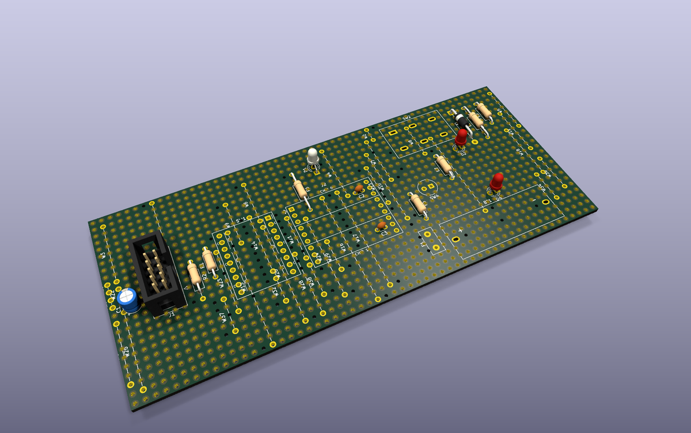
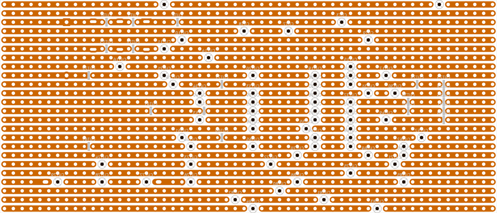
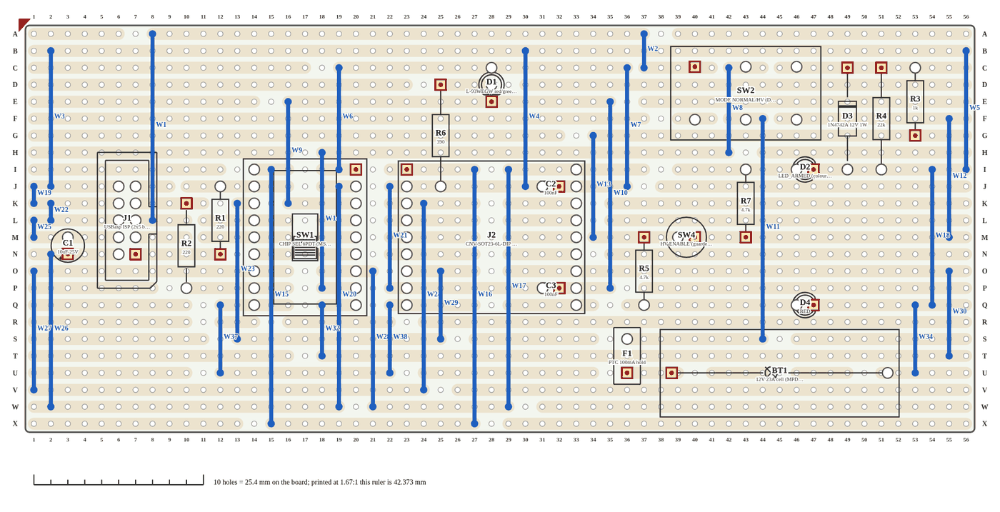
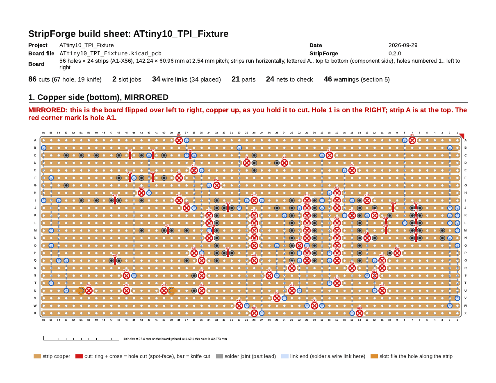
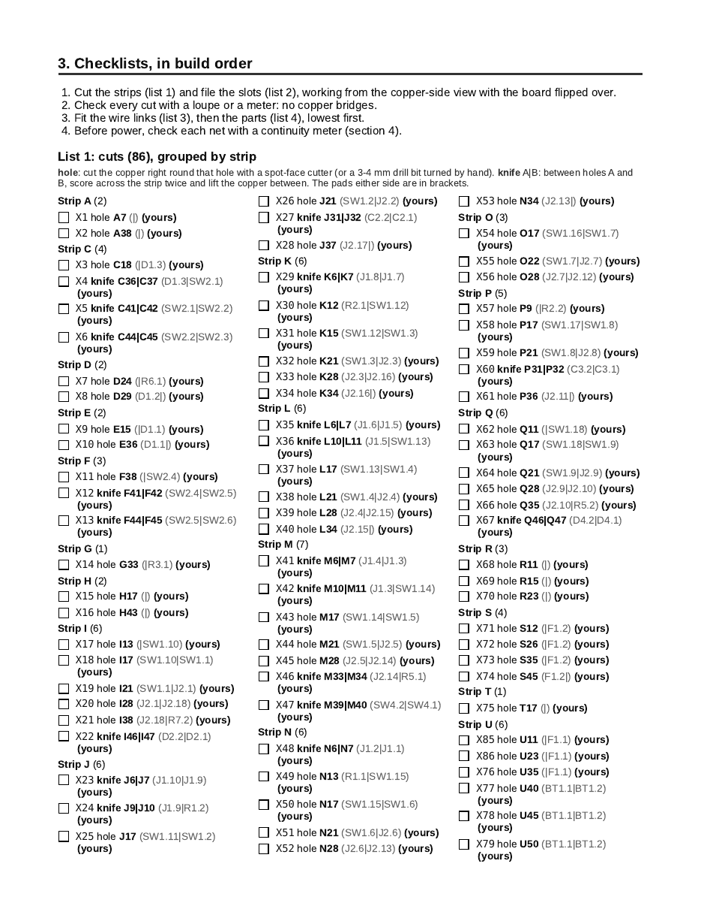

# StripForge

<p align="center"></p>

**Lay out stripboard (Veroboard) circuits in KiCad with real footprints and a live netlist, and get a normal `.kicad_pcb` whose copper is the strips.**

[](https://github.com/SomerledDesign/StripForge/actions/workflows/ci.yml)


> **Beta (0.2.0).** KiCad 10 only. So far it has been tested on one real board (an ATtiny10
> programming fixture on a 24 × 56 hole stripboard). It works well there, but expect rough
> edges on other boards. Keep backups, check the DRC, and please report what you find.

<p align="center">
  
</p>

## Why

Stripboard is still the quickest way to build a one-off circuit you can solder, but laying it out
usually means leaving KiCad for a separate app with its own parts and its own idea of the circuit.
Then the schematic and the build drift apart.

StripForge keeps the whole job inside KiCad:

- **Real KiCad footprints.** It uses the parts from your project, not a second parts library.
- **A live netlist.** The schematic stays the source of truth, and KiCad's schematic-parity check
  keeps the board honest.
- **A normal `.kicad_pcb` as output.** The copper is stripboard strips on B.Cu instead of routed
  tracks. You can open, edit, DRC and plot it like any other board.
- **A printable build sheet.** The copper side mirrored the way you hold the board to cut it, with
  every cut, link and part in checklists.

## What it does

1. **Snaps parts to the grid.** Place the through-hole parts roughly on a 2.54 mm (0.1") grid.
   StripForge snaps each footprint to the nearest holes and logs anything that is off.
2. **Splits the strips by net.** Wherever two nets would share a strip, it cuts the strip. A cut is
   a real gap in the copper plus a `CUT` marker you can see and move.
3. **Adds wire links.** Pieces of one net on different strips are joined with wire links (`W1`,
   `W2`, …), placed on their holes. Links are also added to the schematic, so the two stay in
   sync.
4. **Checks the result with KiCad's DRC**, including schematic parity: a strip carrying two nets, a
   missing link or an extra cut shows up as an error.
5. **Writes a build sheet** (HTML, and PDF when Chrome is installed).

| KiCad's copper layer after Build strips (B.Cu, mirrored) | The build sheet's component side |
|---|---|
|  |  |

The full design is in [Sketch.md](Sketch.md).

## Install

StripForge is a KiCad 10 **IPC plugin**. It is not in KiCad's official Plugin and Content Manager
(PCM) yet.

1. KiCad > Preferences > Plugins: tick **Enable KiCad API**, and check that the Python interpreter
   is KiCad's own (the default on macOS).
2. Get the package `StripForge-0.2.0-pcm.zip` (from the release, or build it yourself with
   `python tools/make_pcm_zip.py`, which writes it to `dist/`). In KiCad, open the Plugin and
   Content Manager and click **Install from File…**.
3. **Restart KiCad.** The first time you open a board, KiCad sets up the plugin's Python
   environment, which takes a minute. Five StripForge buttons then appear in the PCB editor's
   toolbar: **Analyze**, **Build strips**, **Add links to schematic**, **Run DRC** and
   **Build sheet**.
4. **Add the StripForge footprint library** (once): Preferences > Manage Footprint Libraries >
   Global Libraries, add a library with nickname `StripForge` and path
   `${KICAD10_3RD_PARTY}/plugins/com.github.somerleddesign.stripforge/footprints/StripForge.pretty`.
   The built board doesn't need it (its footprints are embedded), but **Update Footprints from
   Library** and placing a link by hand do.

To install by hand instead, copy the *contents* of the zip's `plugins/` folder to
`~/Documents/KiCad/10.0/plugins/com.github.somerleddesign.stripforge/` (macOS; on Linux
`~/.local/share/kicad/10.0/plugins/`, on Windows `Documents\KiCad\10.0\plugins\`), and point the
library at the `footprints/StripForge.pretty` folder in there. To update, install the new zip the
same way and restart KiCad. If a button does nothing, try Preferences > Plugins > **Recreate Plugin
Environment**.

## Using it

Open your project from the KiCad project manager (not the board file on its own, or F8 won't
work), then open the board. Place the parts on the stripboard's hole grid first; the rest is
StripForge's job.

1. **Save the board** (Cmd+S / Ctrl+S), then click **Build strips**. StripForge backs the board up,
   writes the strip copper, the cuts and the wire links into it, and reloads it. The report lists
   every link, anything it couldn't do, and the backup it made. If KiCad says it is busy, press Esc,
   save and click again.
2. **Tools > Update Footprints from Library** (select all footprints, or just the `W` links). This
   gives the links the footprints from the installed library. It matters after you update
   StripForge, e.g. to get 0.2.0's slimmer link outline.
3. Click **Add links to schematic**. It adds a `StripForge:Link` symbol for each `W` link to the
   schematic (and takes out the ones the board no longer has). Each sheet it changes is backed up
   first.
4. **Close the Schematic Editor without saving, and reopen it.** It doesn't reload a file changed on
   disk, and saving would undo step 3.
5. Press **F8** (Update PCB from Schematic) in the board. The links match by path, so nothing moves
   and nothing is duplicated.
6. Click **Run DRC**. "shorts 0" and "unconnected 0" is what you want. The report sorts real
   problems from the noise every stripboard has (dead strip ends, for example).
7. Click **Build sheet**. It writes `<name>-stripforge.sheet.html` (and `.pdf` with Chrome) and
   opens it. Print it, cut the strips from the copper-side view, then fit the links and parts.

Changed something? Move parts, cut markers or links and click **Build strips** again: StripForge
keeps your cuts and links and fills in the rest. Then repeat steps 3 to 7.

| Build sheet, page 1: the copper side, mirrored | Build sheet: checklists in build order |
|---|---|
|  |  |

### Backups

Nothing is overwritten without a copy:

- **The board:** before every build, `<name>.kicad_pcb` is saved as
  `<name>-pre-stripbuild.kicad_pcb`. Older backups move up to `-1`, `-2`, … (the highest number is
  the oldest, usually your placement board before the first build). To undo a build, close the
  board and rename the backup back to `<name>.kicad_pcb`.
- **The schematic:** each sheet Add links to schematic changes is first saved as
  `<sheet>-pre-links.kicad_sch`, rotating the same way.
- **The build sheet:** when it changes, the old one is kept as `<name>-stripforge.sheet-prev.html`
  (and `.pdf`).
- `backup_keep = N` in the config limits how many backups are kept (default `0`: keep them all).

To start over from scratch, restore the oldest board backup **and** the oldest schematic backup.

### The config file

StripForge reads `stripboard.toml` next to the board, or the only other `.toml` there (e.g.
`X56.toml`). Without one it takes the grid from the board outline. The options most people need:

```toml
rows = 24                    # strips (A..X)
cols = 56                    # holes along each strip
origin_mm = [51.27, 51.27]   # the centre of hole A1 in the board file
strip_width_mm = 1.8         # measure your board
diagonal_links = false       # true: allow diagonal links when nothing straight fits
bus_strips = true            # join two pieces through a spare bare strip
max_link_mm = 81.28          # the longest link (32 holes)
knife_cuts = ["SW2"]         # parts with big pads: cut between holes, not at a hole
slotted = ["BT1"]            # parts whose pins need a hole filed longer
skip = ["SW3"]               # parts that are not on the stripboard
backup_keep = 0              # how many board backups to keep (0 = all)

[bend]                       # parts whose legs you can bend onto the holes (mm off)
SW2 = 0.16

[drc]                        # DRC items you accept
ignore = ["silk_overlap"]
```

[`examples/x56.toml`](examples/x56.toml) has every option with comments; the reference below
explains each one.

### Tips

- **Move `CUT` markers, not strip copper.** The strip tracks are redrawn from the markers on every
  build. Drag a marker to another hole (or between two holes) and build again. Don't delete,
  drag or route strip tracks by hand.
- **Don't route copper.** StripForge refuses a board with tracks or vias it didn't draw (apart from
  strip tracks, which it replaces).
- **Keep the link length.** A link footprint has a fixed length (`Link_P7.62`: 3 holes apart). If you
  move a link so it spans a different distance, change its footprint to the matching
  `StripForge:Link_P<mm>` (2.54 mm per hole).
- **Never put a link on a cut.** A wire in a cut hole has no copper to solder to. If you do,
  StripForge drops the cut and warns you, and cuts the strip elsewhere only if two nets would
  short (if the cut is needed exactly there, it keeps the cut and doesn't use the link).
- **Diagonal links: your choice.** StripForge's default allows them when nothing straight fits.
  The test board's config turns them off (`diagonal_links = false`, as in the example above),
  because straight links are easier to fit and check. With diagonals off, a net that needs one is
  joined through a spare strip (two straight links) or reported.
- **Read the build report.** Anything StripForge couldn't join is listed with its pieces: move or
  turn a part so they come closer, or free some holes.

## Status

**Beta, 0.2.0.** StripForge runs inside KiCad 10's PCB editor (the IPC plugin above) and as a
command line (`stripforge analyze | snap | build | link-symbols | drc | sheet`, see
[Development](#development)). Tested with KiCad 10.0.4 on macOS, on one real board. Not yet in the
official PCM.

The plugin does its work on the saved board file with a file backend plus `kicad-cli`, both
headless, and uses KiCad's IPC API only to find, save and reload the open board. The SWIG `pcbnew`
API is avoided because KiCad 11 removes it. Python 3.9+ (KiCad 10's bundled Python on macOS is
3.9).

## Roadmap

| Milestone | Scope |
|---|---|
| **M0: Foundations** | Repo and CI; lossless S-expression round-trip on a KiCad 10 board; netlist parser; fixture intake; strip, cut-marker and link-footprint specs; a first `.kicad_dru`; verify every open question against a real KiCad 10 install. |
| **M1: Model and splitting** | Pure-Python grid snap, strip model, cut placement, net per piece, link proposals and validation, with unit tests and a JSON plan output. |
| **M2: Board output and DRC** | File-backend `.kicad_pcb` writer, `kicad-cli` DRC wrapper and classifier, the two-pass link flow, and mutation tests proving DRC guards the layout. |
| **M3: Build sheet and IPC** | Mirrored SVG/PDF build sheet with cut and link lists; the KiCad plugin. Done in 0.1.0; 0.2.0 is the first beta. |
| **Next** | More boards tested, pre-drilled mounting holes, the official PCM. |

## Reference

The rest of this README is the detailed reference: every action, option and report in full.

### The plugin's actions

- **StripForge: Analyze**: a read-only report: snap, cuts, links needed, slot jobs, hints.
- **StripForge: Build strips**: builds **in the open board itself** (`<name>.kicad_pcb`, the
  project's own board, so F8 keeps working), after saving it and backing it up to
  `<name>-pre-stripbuild.kicad_pcb` (older backups rotate to `-1`, `-2`, …). With
  `place_links = true` (the default) the `W` link footprints are placed on their holes too. It
  then reloads the board in the PCB editor. Writes `<name>.kicad_dru` and the link lists
  (`<name>-stripforge.links.*`) next to it. See **Where the build goes** below;
  `output = "separate"` gives the old `<name>-stripforge.kicad_pcb`.
- **StripForge: Add links to schematic**: writes a `StripForge:Link` symbol for every placed `W`
  footprint into the project's schematic, in place (see **Links from the board to the schematic**
  below). Each changed sheet is backed up first as `<sheet>-pre-links.kicad_sch`, and older
  backups rotate like the board's. **Then close the Schematic Editor without saving and reopen
  it**: it does not reload a file changed on disk.
- **StripForge: Run DRC**: kicad-cli DRC with schematic parity on the built board, classified.
- **StripForge: Build sheet**: writes `<name>-stripforge.sheet.html` (and `.pdf` if Chrome is
  installed) and opens it in the browser.

Each action offers to save the board first, because StripForge reads the saved file. It uses
`stripboard.toml` next to the board if there is one. Without it, it uses the only other `*.toml`
next to the board (e.g. `X56.toml`) if that is a valid StripForge config, and says so in the
report; with several, or none, it derives the grid from the Edge.Cuts outline. If
`<project>.kicad_sch` is there, it exports a fresh netlist with kicad-cli to cross-check pad nets.
Results appear in a dialog ("Show in Finder", "Copy report"). If a button does nothing, see the
status-bar warnings or Preferences > Plugins > "Recreate Plugin Environment". To uninstall a hand
install, delete its folder. Manual test steps: [docs/KICAD-PLUGIN-TEST.md](docs/KICAD-PLUGIN-TEST.md).

The StripForge footprint library (`footprints/StripForge.pretty`, the `W` links'
`StripForge:Link_*` footprints and the cut markers) is bundled in the plugin but **not
registered**: add it to the footprint library table by hand, with nickname `StripForge` (see
[Install](#install)). A PCM plugin package can't register libraries; that needs a separate library
package. The same goes for the symbol
library `symbols/StripForge.kicad_sym` (the generic `StripForge:Link` wire-link symbol): add it to
the symbol library table as `StripForge` if you place links by hand. `stripforge link-symbols`
embeds the symbol in the schematic, so it isn't needed for that.

### First test case

An **ATtiny10 TPI programming fixture** (22 real THT parts, 41 nets; the earlier 25-part M1 board is
frozen in `tests/fixtures/tpi-m1/`). See [examples/tpi-fixture](examples/tpi-fixture/).
It is done when every part snaps, DRC with schematic parity is clean, and the fixture can be built
from the build sheet with no rework on the copper side.

### Development

```sh
python -m venv .venv && source .venv/bin/activate
pip install -e '.[dev]'
stripforge analyze examples/tpi-fixture/ATtiny10_TPI_Fixture.kicad_pcb \
    --netlist examples/tpi-fixture/ATtiny10_TPI_Fixture.net      # add --json for machine output
stripforge analyze <board>.kicad_pcb --config examples/x56.toml  # Kevin's X56 board (A1-X56)
stripforge snap <board>.kicad_pcb -o <out>.kicad_pcb   # move parts by their best-fit shift (dry run without -o)
stripforge build <board>.kicad_pcb --netlist <board>.net --config examples/x56.toml   # in place, backup first
stripforge build <board>.kicad_pcb --separate        # or -o <out>.kicad_pcb: a new file, board untouched
stripforge drc <board>.kicad_pcb                     # kicad-cli DRC + parity against <board>.kicad_sch
stripforge sheet <out>.kicad_pcb --netlist <board>.net --config examples/x56.toml -o <out>.sheet.html
python tools/make_pcm_zip.py   # the KiCad PCM package in dist/
stripforge --help      # plan is still a stub
ruff check . && ruff format --check .
pytest
```

### Building a board: `stripforge build` and the two-pass link flow

`stripforge build <board> [--netlist <net>] [--config <toml>] [--separate | -o <out.kicad_pcb>]`
snaps the parts (as `snap` does), splits the strips by net and writes the result (see **Where the
build goes** below for which file):

- **strips**: one `B.Cu` track per pair of neighbouring holes, hole centre to hole centre,
  `strip_width_mm` wide, on the piece's net. Uncut bare strip is written as copper with no net (it
  is physically there; KiCad only calls it `track_dangling`, which `stripforge drc` filters);
- **cuts**: a real gap in the copper (a hole cut leaves no copper touching the hole; a knife cut
  removes the track between two holes) plus a `StripForge:CUT_Hole` / `StripForge:CUT_Knife`
  marker footprint on `User.1` (refs `CUT1`…, board-only, not in the BOM or position files). The
  markers are embedded in the board, so it loads and DRCs without the StripForge library configured;
- **holes**: every free stripboard hole is drawn (one board-only `SF_HOLES_<strip>` footprint per
  strip with a plated pad per hole, on that strip's net, on `B.Cu` only), so the built board looks
  like the real board in pcbnew and the 3D viewer. Hole cuts are drawn as bare (non-plated) holes;
  holes under part pins and link pads take the part's pad instead. `draw_holes = false` turns this
  off, `hole_drill_mm` (default 1.0) sets the drill;
- **links**: see below;
- next to the built board: `<name>.kicad_dru` (a copy of `rules/stripforge.kicad_dru`, which
  `kicad-cli` and pcbnew pick up automatically; a different `.kicad_dru` that was already there is
  first copied to `<name>-pre-stripbuild.kicad_dru`) and the link proposal as
  `<name>-stripforge.links.json`, `.links.csv` and `.links.txt`.

**Where the build goes: `output`.**

| toml key | values | default |
|---|---|---|
| `output` | `"in_place"`: build into the board itself (`<name>.kicad_pcb`) · `"separate"`: write `<name>-stripforge.kicad_pcb` and leave the board alone | `"in_place"` |
| `backup_keep` | how many `-pre-stripbuild` backups to keep in all (the unnumbered one counts as 1); `0` keeps every one | `0` |

In place is the default because F8 (Update PCB from Schematic) only works in the project's own
board, opened from the KiCad project manager: in a separate file pcbnew says "PCB editor is opened
in stand-alone mode".

**Backups rotate like logrotate.** Before every in-place build, just before the board is written:
1. if `<name>-pre-stripbuild.kicad_pcb` exists, the numbered backups move up by one, highest number
   first (`-pre-stripbuild-2` → `-3`, then `-1` → `-2`), and then `-pre-stripbuild` → `-1`;
2. the board as it is right now is saved as the new **`<name>-pre-stripbuild.kicad_pcb`**.

So the unnumbered backup is always the board just before the latest build, `-1` the one before
that, and the highest number is the oldest (the first build's placement board, unless `backup_keep`
deleted it). Nothing is ever
overwritten: if a rename fails or its target already exists, the build stops with an error before
the board or `.kicad_dru` is written (the renames already done stay done; nothing is lost).
`backup_keep = N` (default `0` = no limit) deletes the oldest numbered backups after rotating so
that N backups remain in all. The report prints the backup path, which backups moved, and how to
undo. **To undo the latest build:** close the board, delete `<name>.kicad_pcb` and rename
`<name>-pre-stripbuild.kicad_pcb` back to `<name>.kicad_pcb`. To go further back, rename `-1`, `-2`,
… instead. A `.kicad_dru` with other DRC rules is copied once to `<name>-pre-stripbuild.kicad_dru`
(it doesn't rotate); rename it back too if you undo the first build. On the command line `--separate` (or `-o <other file>`) overrides the
toml for one run; `-o <board> --in-place` is the same as the default. A `-stripforge` board (from
`output = "separate"`) is always rebuilt in place, with no backup.

The input must be the placement board: a track or via StripForge did not write is refused. Building
again from a StripForge output removes its own strips and cut markers first and rewrites them (a
strip track re-drawn by hand along a strip row, which lost StripForge's uuid, is replaced too, with a
warning; any other track, a via or F.Cu copper is still refused); the output is deterministic (same input, same bytes). Parts outside the Edge.Cuts outline are reported,
and copper is only written for holes inside the outline.

**Pass 1.** For every net split over several strip pieces, StripForge proposes wire links like a
minimum spanning tree: fewest and shortest links, from **any free hole** of one piece to any free
hole of another (every grid hole counts, not only footprint holes; never a cut, a pad or another
link's hole). In order of preference a link runs:

1. straight down a column (`StripForge:Link_P2.54` … `Link_P81.28`, 1–32 pitches); a cut may slide
   (or a piece extend) within its gap to give both pieces a free hole in the same column;
2. along a strip, bridging a cut (rare: two pieces of one net on one strip are only split when a
   different-net pin sits between them, and a wire can't run over that pin);
3. as two straight links meeting on a **bus strip** (`bus_strips`, default on): a piece of unused
   bare strip that the net takes over, with a straight drop from each piece (a cut may slide to line
   one up); hole cuts isolate the bus from the rest of that strip where that leaves a useful
   remainder (the report says "hole cut at R5 isolates a bus strip");
4. only when nothing straight fits, on a diagonal (`diagonal_links`, default on), rotated: a
   `Link_P*` when the length is a whole number of pitches (3-4-5 and friends), otherwise an
   off-pitch `Link_D<mm>` (`Link_D3.59` for a 1x1 offset … `Link_D81.16`; 305 footprints in the
   library; `off_pitch_links = false` keeps to whole-pitch diagonals).

A straight link always beats a diagonal, however long; then fewer crossings under parts, fewer
moved cuts, shorter wire.

Rules for every link: no longer than `max_link_mm` (default 81.28 mm = 32 pitches); never crossing
or touching another link; never passing over (within 0.9 mm of) a part pin or another link's end,
since bare wire would short to it; part courtyards avoided where possible (a wire may run under a
part, reported). The report lists each link, with the rotation for diagonals:

```
W4    D12 -> J12  (0.6")   StripForge:Link_P15.24   GND
W19   J16 -> T16  (1.0")   StripForge:Link_P25.40   +5V_T  (to bus strip T)
```

Each link's length is in inches, **pad-to-pad** (pitches × 0.1"; a diagonal's real length to
0.01"). After the list comes a **link cut list**, one row per length, shortest first, so you can
cut and bend every link of one length and fit them in one go:

```
Link cut list (pad-to-pad): 14 length(s), 34 link(s)
   Length  Qty  Links
     0.1"    8  W3, W15, W18, W21, W24, W26, W31, W33
     0.2"    5  W2, W11, W12, W13, W14
  ...
  Note: Lengths are the pad-to-pad span only. Remember to add wire for both legs: ...
```

The lengths are the span between the two holes only: add wire for both legs through the board, the
bend and the solder or clinch (roughly 0.1"–0.2" a leg). `link_lead_allowance_in = 0.15` (inches a
leg, default 0 = off) adds a **Cut** column: pad-to-pad + 2 × allowance. The build sheet has the
same chart (with checkboxes) under the wire-link list.

**Lead-stretch suggestions** (report only, on by default): after the plan, StripForge checks
whether a longer lead on a leaded two-pin part (R, C, D, L, F) could take the place of a link: the
part keeps one pin where it is and its pin on the link's net moves to a free hole on the far side,
so that `W` need not go into the schematic. It is suggested only when the net stays connected
without the link, the new hole is free and already on that net (no new cut, no short, not beside a
`knife_cuts` part's big pad), the new line crosses no link, passes over no lead and runs under no
part it didn't already, and the span grows by at most `max_pitches` (axial, default 6) or
`radial_max_pitches` (legged caps, LEDs, fuses; default 2). Nothing is moved: change the part's
footprint (longer pitch or rotated) so the pin lands on the new hole, leave the link out and build
again.

```toml
[stretch]
# enabled = true            # false: no suggestions
# max_pitches = 6           # axial parts: how much longer the span may get
# radial_max_pitches = 2    # radial parts
# skip = ["C1"]             # never stretch these
# allow_under_parts = false # true: also suggest a new line under another part
```

```
Lead stretches: 1 suggestion(s), 1 link(s) fewer (report only; nothing moved)
  replaces W26: move R2 pin 2 from O10 to P10 (R2.1 stays at K10; span 4 -> 5 pitches, +1)
```

Add them to the schematic: one 2-pin link per line, the generic `StripForge:Link` symbol from
`symbols/StripForge.kicad_sym` (or `Jumper:Jumper_2_Bridged`, or a 0 Ω resistor), Reference `W4`,
Footprint `StripForge:Link_P15.24`, both pins wired to the net (`GND`). Or let StripForge do it:
see **Links from the board to the schematic** below.
Then press F8 (Update PCB from Schematic) in the same board. `<name>-stripforge.links.txt` has the
full list and these steps. A
net that still can't be joined is an error in the report, naming its pieces: move or rotate a part
so they come closer, or free some holes.

**Pass 2.** Build again in the board that now has the `W` footprints (anywhere on the board): each
`W` is matched by reference and net to the proposal and placed on its two holes (pad 1 on the upper
hole; a straight-down link at 0°, a diagonal or along-the-strip link rotated so pad 2 lands on
its hole). Missing, extra, wrong-footprint or wrong-net `W`
parts are reported. The `W` parts are not treated as components, so the strips and cuts don't
change.

Exit codes: 0 complete (every net joined, every link placed), 1 incomplete (links still to add or
place, unlinkable nets, rejected parts), 2 refused (bad input, conflicts, output = input).

**Links from the board to the schematic: `place_links` and `stripforge link-symbols`.** Instead
of adding the `W` symbols by hand, let the board lead:

```sh
stripforge build MyProject.kicad_pcb --config X56.toml            # place_links = true by default
stripforge link-symbols MyProject.kicad_pcb --in-place             # reads/edits MyProject.kicad_sch
#   each changed sheet is first backed up as <sheet>-pre-links.kicad_sch (older ones rotate to -1, -2, ...)
#   or --out-dir DIR: a copy of the project; --schematic <root .kicad_sch> picks another schematic
```

`place_links = true` (the default; `--no-place-links` or `place_links = false` turns it off) places every proposed link's
`Link_P*`/`Link_D*` footprint on its holes in the first build, both pads on the link's net, so there
are no ratsnest lines left to wire. Each is locked (F8's "Delete footprints with no symbols" won't
remove it), has Value `Link`, and carries the schematic path of the symbol that `link-symbols`
will write. `link-symbols` then adds one `StripForge:Link` symbol per `W` footprint the schematic
lacks: its reference, its Footprint field (`StripForge:Link_P27.94`), and a label with the net's
name on both pins. A `/Sheet/NAME` net gets local `NAME` labels on that sheet. Any other net
(`GND`, a global label) gets global labels. An unnamed net (`Net-(SW2B-B)`) also gets a global
label of the same name on one of its existing pins, so it keeps its name. The symbols are set out
in a grid right of the drawing, under a note, and the paper is enlarged if they don't fit. The
copy (`--out-dir`) holds every sheet, the project file, the library tables (with `${KIPRJMOD}`
pointing back at the original project) and the board under the project's name, ready for
`kicad-cli` netlist, ERC and `stripforge drc` parity. Then press F8: the symbols and footprints
match by path, so nothing moves and no second copy appears. KiCad's own Tools > Update Schematic
from PCB can't do this step, because it only updates symbols that already exist. For a footprint
with no symbol it reports "Cannot find symbol for footprint" (eeschema `backannotate.cpp`, KiCad
10.0). Until the symbols are in, `stripforge drc` counts each `W` as a parity `extra_footprint`
and says to run `link-symbols`. With `place_links` on, don't also add the `W` symbols by hand: F8
would bring in a second footprint for each link. The `StripForge:Link` symbol definition is
embedded in the schematic (`lib_symbols`), so no sym-lib-table entry is needed (ERC stays clean);
add the `StripForge` library by hand only if you want to place links yourself.

**W symbols that are already in the schematic** (for example placed by hand, with footprints from
Update Schematic from PCB but no nets) are kept where they are and never duplicated:
- **Bare pins:** each pin with nothing on it gets a net label (local or global, as above).
- **Path:** the symbol's uuid is set to the one its placed footprint's path names, so F8 matches
  the two by path instead of adding a second footprint. If the symbol sits on another sheet than
  that path, the report warns instead.
- **Footprint:** an empty or different Footprint field is set to the board's.
- **Conflicts:** a pin already wired to a label of another net is left unchanged, together with
  the rest of that symbol, and reported as a `CONFLICT` to fix in the schematic or on the board. The W footprints
are embedded in the board, and F8 leaves a matched footprint alone when its library ID is the
same, so the footprint library isn't needed for F8 either.

**The same flow in KiCad** (open the project in the KiCad project manager, then its board):
1. Click **Build strips**. The board is saved, backed up to `<name>-pre-stripbuild.kicad_pcb`,
   built in place with the `W` links placed on their holes, and reloaded.
2. Click **Add links to schematic**. It adds the `W` symbols to the schematic, and the report
   lists them with the sheet backups. If the Schematic Editor is open, close it without saving
   and reopen it.
3. Optionally press F8 in the same board. The symbols and the placed footprints match by path, so
   nothing moves and nothing is duplicated.
4. Click **Run DRC** (unconnected should be 0, apart from any net the report calls unlinkable),
   then **Build sheet**.

With `place_links = false`: click Build strips, add the listed links to the schematic yourself,
press F8 in the same board, then click Build strips again to place them.

### Moving cuts and links yourself

StripForge's plan is a starting point: you can move any cut or link, and building again keeps what
you did ("locked") and only fills in what is still unjoined. Two ways:

**In the built board, in pcbnew:**
1. Open the built board (`<name>.kicad_pcb` after an in-place build). Cut markers are the `CUT…` footprints on `User.1`; links are the `W…`
   footprints (after pass 2).
2. Move a cut: drag its `CUT…` marker onto another hole (a `CUT_Hole`) or between two holes (a
   `CUT_Knife`). **Only move the marker; leave the strip copper alone.** The strip tracks are
   regenerated from the markers on every build, so after **Build strips** the gap is where the
   marker is and the old gap is filled. Don't delete, drag or route strip tracks by hand: the
   interactive router won't join copper of two different nets (the old gap has one net either
   side), and any strip track you do draw is thrown away and redrawn on the next build. Add a cut: place a `StripForge:CUT_Hole` or `CUT_Knife` footprint (any ref, e.g.
   `CUT99`). Remove a cut: delete its marker (if that would short two nets, StripForge puts the cut
   back and says so).
3. Move a link: drag the `W` footprint so both pads sit on holes (grid 2.54 mm; rotate with R for
   an along-the-strip or diagonal link). A link has a fixed length: to make it longer or shorter,
   change its footprint to the right `StripForge:Link_P<mm>` (Link_P2.54 per pitch; `Link_D*` for
   off-pitch diagonals), or change it in the schematic and press F8. A link dropped in from the
   library (reference `REF**`) gets the next free `W` number and its net on the next build. If a
   link end lands on a hole-cut marker, the link wins: the marker is dropped with a warning, and
   the strip is cut elsewhere only where two nets would otherwise short. A link the build can't use
   (a pin in its hole, two nets shorted) keeps its name and is reported as not used, not placed.
   To remove a link, delete its `W` footprint and build again. A link that no longer joins anything
   (one end on bare strip no other link reaches, e.g. the second leg of an old bus strip) is
   removed by the build itself. Then **Add links to schematic** takes stale W symbols out of the
   schematic (backed up first), so F8 doesn't bring the footprint back.
4. Click **Build strips** with that board open: it is saved, rebuilt **in place** (same file),
   keeping your markers and links where they are, and reloaded (backed up first, like every build).
   The report lists your links as "(yours, kept)", the new ones to add, and any problem.

**In `stripboard.toml`, as text** (easiest; applied on every build, also on the placement board):

```toml
[manual]                         # a table: put it after the top-level keys
links = ["J16-T16", "C42-X42"]   # wire links from hole to hole (any two free holes)
cuts = ["J15", "C34-C35"]        # a hole cut at J15, a knife cut between C34 and C35
no_cut = ["J17"]                 # never cut here (StripForge picks another spot in that gap)
```

Your cut replaces StripForge's cut in the same gap and is never slid. StripForge checks your edits
and warns when: a cut or link lands on a hole with a pin in it (or a link on a cut or a slot's hole);
a link would short two nets or lands on a strip of another net than its schematic net; your links
cross; a missing cut would short two nets (it is put back); a cut splits a net that can't then be
joined. Rejected links are reported, and their `W` reference is reused for the link that replaces
them. `respect_edits = false` ignores the board's markers and links and plans from scratch (the
`[manual]` table still applies). The build sheet marks your cuts and links "(yours)".

### Build sheet: `stripforge sheet`

`stripforge sheet <built board> [--netlist <net>] [--config <toml>] -o <out>.html [--png] [--no-pdf]`
writes one self-contained, printable HTML file (Letter landscape, light background, works offline).
When Chrome/Chromium is found (`--chrome`, `$STRIPFORGE_CHROME`, `PATH`, or the macOS app) it
also writes `<out>.pdf`. `--png` adds `<out>.copper.png` / `<out>.component.png` previews. The two
view SVGs and `<out>.cuts.csv` are always written. When the new sheet differs from the one already
there, the old HTML and PDF are kept as `<out>-prev.html` / `.pdf` first (older ones rotate to
`-prev-1`, `-prev-2`, ..., limited by `backup_keep`); an unchanged sheet makes no backup. The sheet has:

1. **Copper side (bottom), MIRRORED:** as seen with the board flipped over to cut (hole 1 on the
   right). It shows cuts (hole ✕, knife bar), solder points, link ends and slot jobs, with strip
   letters and hole numbers on every edge, an A1 corner mark and a 10-hole ruler.
2. **Component side (top):** part outlines, refs, values, pin-1 marks and links drawn as wires.
3. **Checklists in build order** with checkboxes:
   - cuts grouped by strip;
   - slot jobs ("file U16 0.025" (0.635 mm) toward U17 (toward the part centre)");
   - wire links (ref, from, to, length pad-to-pad in inches and holes, footprint, and "diagonal,
     4 across and 3 down", "along the strip" or "to bus strip R"); both views draw every link at
     its real angle; then the **link cut list** (length | qty | links, shortest first, with the
     reminder to add wire for the legs) and any lead-stretch suggestions;
   - parts, low-profile first, with every pin's hole.
4. **Net check:** every net and every hole it must touch, for a continuity meter.
5. **Warnings:** knife cuts, courtyard overlaps, unlinkable nets, links still to add, and a banner
   if the file isn't a (current) StripForge build.

Large boards are split across pages.

### DRC: `stripforge drc`

`stripforge drc <board.kicad_pcb> [--no-parity] [--report drc.json] [--json]` runs
`kicad-cli pcb drc --format json --severity-all --schematic-parity` (kicad-cli 10.0.4; found via
`--kicad-cli`, `$KICAD_CLI`, `PATH` or the macOS app bundle) and classifies the result:

- **real problems** (exit 1): shorts, clearance, unconnected items, schematic parity, violations of
  a StripForge (`SF …`) rule, and any other error;
- **filtered, counted** (expected on stripboard): `track_dangling` (dead strip ends), the
  "footprint library not configured" warning (the footprints are embedded), and courtyard/library
  items of the drawn `SF_HOLES_*` hole footprints ("N stripboard-hole item(s)": the holes under
  parts are real holes);
- **reported, not failing**: a `W` link over a part courtyard (a wire can run under a part), and
  other warnings (silk), summarised by type.

**Config filters (`[drc]` in `stripboard.toml`):** pass `--config` (the plugin always does) and
the table's filters apply. Everything they suppress is still counted, one line per type or pair:
`filtered (config): 1 courtyards_overlap J2/C2, 2 pth_inside_courtyard J2/C2, 1 silk_overlap`.

```toml
[drc]
# KiCad 10 DRC type names, suppressed board-wide (a name KiCad doesn't have is warned about)
ignore = ["silk_overlap", "silk_over_copper", "silk_edge_clearance"]
# courtyard overlaps accepted for exactly these reference pairs (order doesn't matter): covers
# courtyards_overlap and pth_/npth_inside_courtyard between the two parts; others still count
allow_overlap = [["J2", "C2"], ["J2", "C3"]]
```

Unknown keys in `[drc]` are an input error (exit 2). The type names are the `type` values in
kicad-cli's JSON report (KiCad 10's list is in `stripforge.config.KICAD_DRC_TYPES`).

Schematic parity needs the `.kicad_sch` (and `.kicad_pro`) next to the board with the same name;
without it kicad-cli skips parity and the report says so. An in-place build keeps that name, so
parity runs against `<name>.kicad_sch` directly. For a `<name>-stripforge.kicad_pcb` board
(`output = "separate"`) `stripforge drc` finds `<name>.kicad_sch` itself (or pass `--schematic`)
and runs on a shadow copy of the project in a temp folder. After pass 1 the unconnected items are
exactly the links still to add; after pass 2 they should be 0. Exit 3 means kicad-cli was not found
(the tests needing it are skipped in CI).

### Slotted parts

Parts whose pins are not on the 2.54 mm grid along a strip (the MPD BH23APC 23A holder, BT1) are
listed in `slotted = ["BT1"]`. Their end holes are filed toward the part centre instead of
rejecting the part. The filing distance is the pad's offset from its hole plus half of how much
longer than wide its drill is: for the BH23APC (oval 1.635 × 1.0 mm slots 0.3175 mm inboard;
slot centres 32.385 mm apart, pins seat 31.75 mm apart) that is **0.025" (0.635 mm)** at each
end. Place the footprint with its origin on a hole; if one end is nearer its hole than the other,
analyze warns, e.g. "BT1 slot offsets 0.000/0.635 mm; shift -0.318 mm along the strip (toward lower
hole numbers) to centre it" (in KiCad: Move Exactly, X -0.3175).

### Bent legs: `[bend]` (the "Beckham tolerance")

Some parts can't sit on the holes but their legs bend far enough to reach them, like Kevin's DPDT
slide switch (SW2): 300 mil pin pitch along a row but 312 mil between the rows. Centred, each row
is 6 mil (0.1524 mm) off its strip, just over `snap_tol_mm` (0.15 mm). List such parts in a `[bend]`
table with the most a leg may be off its hole, in mm (6 mil = 0.1524 mm, 10 mil = 0.254 mm):

```toml
[bend]   # Beckham tolerance: parts whose legs can be bent onto the holes (bend it like Beckham)
SW2 = 0.16
```

- The value replaces `snap_tol_mm` for that part only, in any direction. For a part that is also
  `slotted`, the slot takes the along-strip offset and `[bend]` sets the across-strip tolerance.
- Values must be more than 0 and at most 0.5 mm; above 0.3 mm there is a warning (check the part
  really bends that far). A `[bend]`, `slotted` or `skip` entry for a part that isn't on the board
  is warned about.
- Analyze lists every leg to bend (`bend legs: SW2 [bend] 0.16 mm [pad 1 at C40: 0.152 mm (6.0 mil)
  across the strip; ...]`) and warns that the part was accepted with its bend tolerance. The build
  sheet's parts list says "bend legs up to 0.152 mm (6.0 mil) across the strip to fit the holes".
- `[bend]` parts are placed off the holes on purpose, so the best-fit shift never moves them.
- A rejected part now gets the matching hint: a miss across the strip suggests `[bend]` with a
  value (e.g. `SW2 = 0.16`), a miss along the strip suggests `slotted`, and a part whose pins match
  the pitch but sit off the grid is told how far to move it (KiCad: Move Exactly).

### Big-pad parts: `knife_cuts`

Parts whose pads overhang neighbouring holes (a slide switch's 2.9 mm blade pads, for example) need
knife cuts, not drilled hole cuts, around them: a hole cut next to the pin would drill into the pad.
List them:

```toml
knife_cuts = ["SW2"]
```

Every cut that isolates a pin of a listed part is a knife cut, placed so the hole beside each of
its pins stays on that pin's net (the pad overhangs it). The link planner never slides those cuts
closer. When two pins of different nets are too close to leave a spare hole beside each (one or two
holes apart), the best knife cut is still made and a warning says so: check DRC clearance there.
The build sheet marks them "knife, per SW2 setting". An unknown reference is reported.

### Trim unused strip ends: `trim_pieces`

After the links are planned, every net piece is cut back to its outermost used hole (a pin or a
link end) when that frees at least `trim_min_free` holes (default 4) as bare copper again, free for
other nets and buses:

```toml
# trim_pieces = true
# trim_min_free = 4
```

Hole vs knife follows the usual rules (and `knife_cuts`). When a net is left unjoined, planning is
also tried with the pieces trimmed first (more bare strip for buses) and kept if it joins more.

### Parts off the stripboard: `skip`

`skip = ["SW3", "J9"]` lists parts that are not on the stripboard (panel-mounted, hand-wired). They
are not snapped or rejected, their pads get no strips, and nothing is planned for them. Analyze
warns, per part, which nets must be hand-wired to it, and the build sheet lists them under "Wired
off-board". Nets they share with on-board parts are still split and linked as usual on the
board; the wire to the skipped part is up to you. (`offboard_refs`, the older name, still works;
the two lists are merged.)

### Strip width and the DRC rules

`strip_width_mm` is 1.8 mm (caliper-measured on Kevin's X56 board). The rules in
`rules/stripforge.kicad_dru` are generated for that width: **whenever `strip_width_mm` changes,
regenerate them** with `python rules/gen_dru.py --strip-width <w>`. `stripforge build` warns when
the rules file and the config disagree.

### Hole labels

Copper strips run horizontally. Strips (rows) are letters `A..Z`, then `AA, AB, …, ZZ`
(spreadsheet style); holes along a strip are numbered from 1. The top-left hole (component side) is
`A1`, so `K12` is the 12th hole on the 11th strip. The TPI fixture's 30 × 25 grid runs `A1`–`Y30`.
Reports use labels throughout; the `--json` output also keeps the 0-based `(col, row)`.

```
src/stripforge/
  cli.py          command-line entry (analyze | snap | build | link-symbols | drc | sheet; plan is a stub)
  analyze.py      snap + split report (text or JSON), best-fit moves
  hints.py        placement hints (parts lying along a strip, 90° rotation estimate)
  config.py       stripboard.toml model
  netlist.py      kicad-cli netlist (kicadsexpr) parser
  sexpr.py        S-expression reader/writer (byte-exact for untouched nodes)
  board.py        footprints, pads (absolute positions, rotation) and outline from a .kicad_pcb
  grid.py         2.54 grid, hole labels, per-footprint snap with tolerance and slots
  strips.py       rows -> hole-to-hole segments
  splitter.py     cut placement + net per piece
  links.py        link proposals (pass 1), link reports
  writer.py       stripforge build: strips, cut markers, link placement (pass 2 / place_links)
  linksym.py      stripforge link-symbols: W footprints -> StripForge:Link symbols in the schematic
  resources.py    StripForge footprint library and rules lookup
  validate.py     pure-Python short/open/parity pre-check
  drc.py          kicad-cli pcb drc wrapper + classifier
  buildsheet.py   stripforge sheet: printable HTML/PDF build sheet, view SVGs/PNGs, cuts CSV
  backends/       file (.kicad_pcb), ipc (kipy; stub), swig_fallback (isolated, unused)
plugins/          KiCad 10 IPC plugin: plugin.json, sf_*.py entry scripts, stripforge_plugin.py, icons
symbols/          StripForge.kicad_sym: the generic StripForge:Link symbol (2 passive pins, ref W,
                  value Link, footprint filter Link_*); bundled in the plugin as plugins/symbols/
tools/            make_pcm_zip.py (PCM package), make_icons.py (toolbar icons)
```

### Icon

The StripForge icon is `resources/icon.png`: Kevin's 64 × 64 px icon (the copper "S" with a
"StripForge" wordmark, 2026-09-27), used as the KiCad Plugin and Content Manager icon. The PCM
`metadata.json` schema has no icon field: the PCM takes the icon from `resources/icon.png` in the
package archive, and from an `icon.png` next to `metadata.json` in the metadata repository. The
toolbar icons in `plugins/icons/` (24 and 48 px, one per action with a letter badge) are made from
it by `python tools/make_icons.py`, cropped to the "S" because the wordmark can't be read at
toolbar size. The larger artwork (`assets/StripForge-icon-1024x1024.png`) is kept for reference.

See [CONTRIBUTING.md](CONTRIBUTING.md) and [CHANGELOG.md](CHANGELOG.md).

## Credits and prior art

- **[perfboard-studio](https://github.com/medinstech/perfboard-studio)** (Apache-2.0) inspired
  StripForge. Its stripboard model (strips split into segments at the cuts), connectivity checks
  and build guide shaped this design. Any code adapted from it will keep its attribution and
  Apache-2.0 notices, which is compatible with GPL-3.0.
- **[VeroRoute](https://sourceforge.net/projects/veroroute/)**, **VeeCAD** and
  **[DIYLC](https://github.com/bancika/diy-layout-creator)** are the standalone stripboard and
  layout tools that came before. They are credited for ideas only; no code is taken from them.

## License

Copyright (C) 2026 Somerled Design.

StripForge is free software: you can redistribute it and/or modify it under the terms of the
**GNU General Public License** as published by the Free Software Foundation, either **version 3** of
the License, or (at your option) **any later version** (`GPL-3.0-or-later`). It is distributed in
the hope that it will be useful, but WITHOUT ANY WARRANTY. See [LICENSE](LICENSE) for the full text.

## Author

**Somerled Design** ([@SomerledDesign](https://github.com/SomerledDesign))
